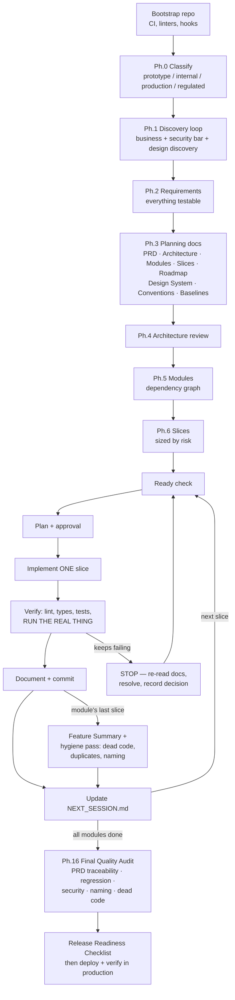

# build-web-app

**A documentation-driven workflow skill for building industrial-grade web applications with an AI coding assistant** — from the first idea to a production release, across dozens of sessions, without the AI losing context, hallucinating APIs, drifting scope, or shipping unverified code.

Technology-agnostic: nothing in it depends on a specific language, framework, or industry. It has been designed for [Claude Code](https://claude.com/claude-code) skills, but the methodology works with any AI coding assistant that can read files from your repo.

---

## The problem this solves

AI-assisted development fails in five recurring ways:

| Failure mode | What it looks like |
|---|---|
| **Context loss** | A new session forgets decisions already made and re-derives or contradicts them |
| **Hallucination** | The assistant assumes API/library behavior or business rules instead of checking |
| **Scope drift** | "While I'm in there" edits spread across files that had nothing to do with the task |
| **Silent rework** | The same design question gets re-litigated and answered differently weeks later |
| **Unverified completion** | Code that type-checks and passes tests but was never actually run — so a real bug ships |

The core idea: **documentation is not an end-of-project artifact — it's the mechanism that makes long, multi-session AI work possible.** A project built with this workflow can be resumed by a session with *zero* memory of any prior conversation, using only the files in the repo.

---

## What's inside

A navigator (`SKILL.md`) over four reference books. The AI loads **only** the book the current moment needs — that's the workflow's own context-management principle applied to itself.

| File | Book | Covers |
|---|---|---|
| `SKILL.md` | Navigator | What to load when, the lifecycle map, non-negotiable habits |
| `references/methodology.md` | Book 1 | Project classification, discovery, requirements, planning docs, architecture review, module/slice decomposition, slice right-sizing, context & memory management, plan-vs-reality conflicts, project completion |
| `references/coding-standards.md` | Book 2 | Per-slice implementation discipline: Ready/Done gates, migrations, config, integrations, concurrency, feature flags, verification, testing strategy, documentation updates, git workflow, anti-hallucination rules, recovery procedure, module-close hygiene |
| `references/frontend-design.md` | Book 4 | Design discovery (the visual direction is *asked*, never defaulted), reference-site extraction with real measurements, workflow-first screens (quick-add, bulk-add, one task per screen), bento grids and other layout systems, smooth animation & low-bandwidth performance, UI verification |
| `references/templates.md` | Book 3 | Copy-pasteable templates for every document the workflow uses |

---

## Installation

### Claude Code (recommended)

Clone into your skills directory — personal (available in every project):

```bash
# macOS / Linux
git clone https://github.com/Anandhuvimalan/build-web-app.git ~/.claude/skills/build-web-app

# Windows (PowerShell)
git clone https://github.com/Anandhuvimalan/build-web-app.git $env:USERPROFILE\.claude\skills\build-web-app
```

…or per-project (shared with your team via the project repo):

```bash
git clone https://github.com/Anandhuvimalan/build-web-app.git .claude/skills/build-web-app
```

That's it. Claude Code discovers the skill automatically. It activates when you start a project, plan architecture, implement a slice, design UI, or prepare a release — or invoke it explicitly:

```
/build-web-app
```

### Any other AI assistant

Copy the four markdown files into your project (e.g. `docs/workflow/`) and instruct the assistant, at the start of every session, to read `SKILL.md` first and follow its navigation rules.

---

## The process at a glance

### The full lifecycle

```
┌────────────────────────────  ONCE, AT THE START  ─────────────────────────────┐
│                                                                                │
│  ┌───────────┐   ┌──────────┐   ┌───────────┐   ┌──────────────┐              │
│  │ Bootstrap │──▶│ Classify │──▶│ Discovery │──▶│ Requirements │              │
│  │ repo, CI, │   │ Ph.0     │   │ Ph.1      │   │ Ph.2         │              │
│  │ linters   │   │ proto /  │   │ business +│   │ functional + │              │
│  └───────────┘   │ internal/│   │ security  │   │ NFRs, all    │              │
│                  │ prod /   │   │ bar +     │   │ testable     │              │
│                  │ regulated│   │ DESIGN    │   └──────┬───────┘              │
│                  └──────────┘   │ discovery │          │                      │
│                                 └───────────┘          ▼                      │
│  ┌────────────┐   ┌───────────┐   ┌──────────────────────────────┐            │
│  │   Slices   │◀──│  Modules  │◀──│ Planning Docs (Ph.3) +       │            │
│  │   Ph.6     │   │  Ph.5     │   │ Architecture Review (Ph.4)   │            │
│  │ sized by   │   │ dependency│   │ PRD · ARCHITECTURE · MODULES │            │
│  │ RISK, not  │   │ graph     │   │ SLICES · ROADMAP · DESIGN    │            │
│  │ uniformly  │   └───────────┘   │ CONVENTIONS · BASELINES      │            │
│  └─────┬──────┘                   └──────────────────────────────┘            │
└────────┼───────────────────────────────────────────────────────────────────── ┘
         │
         ▼
┌──────────────────────  THE LOOP — once per slice, forever  ────────────────────┐
│                                                                                │
│   ┌──────────┐  ┌───────┐  ┌──────┐  ┌─────────┐  ┌────────┐  ┌────────┐      │
│   │ Read the │─▶│ Ready │─▶│ Plan │─▶│Implement│─▶│ Verify │─▶│Document│──┐   │
│   │ docs     │  │ check │  │ +    │  │ ONLY    │  │ lint · │  │ + one  │  │   │
│   │ (narrow, │  │ Ph.8  │  │ get  │  │ this    │  │ types ·│  │ commit │  │   │
│   │ cold-    │  │ gate  │  │ appr-│  │ slice   │  │ tests ·│  │ Ph.10─ │  │   │
│   │ start    │  └───────┘  │ oval │  │ Ph.8    │  │ RUN IT │  │ 11     │  │   │
│   │ order)   │             └──────┘  └─────────┘  │ Ph.9   │  └────────┘  │   │
│   └──────────┘                                    └────────┘              │   │
│        ▲                                                                  │   │
│        │            ┌──────────────────────────────┐                      │   │
│        └────────────│ Update NEXT_SESSION.md       │◀─────────────────────┘   │
│                     │ (the next session starts     │                          │
│                     │  here with zero memory)      │                          │
│                     └──────────────────────────────┘                          │
│                                                                                │
│   Stuck / plan conflicts with reality?  → STOP, re-read docs, resolve          │
│   explicitly, record the decision (Ph.14 + Ph.15) — never brute-force.         │
│                                                                                │
│   Last slice of a module?  → module Feature Summary + HYGIENE PASS             │
│   (dead code, duplicates, naming, TODOs — its own commit)                      │
└────────────────────────────────────┬───────────────────────────────────────── ┘
                                     │  all modules done
                                     ▼
┌─────────────────────────────  SHIP (Ph.16)  ──────────────────────────────────┐
│                                                                                │
│  ┌─────────────────────┐   ┌──────────────────────┐   ┌────────────────────┐  │
│  │ FINAL QUALITY AUDIT │──▶│ RELEASE READINESS    │──▶│ Deploy + verify    │  │
│  │ PRD traceability ·  │   │ secrets · migrations │   │ the real thing in  │  │
│  │ full regression ·   │   │ rollback · monitoring│   │ production (real   │  │
│  │ whole-system        │   │ on-call · sign-off   │   │ payments, email,   │  │
│  │ security · naming · │   └──────────────────────┘   │ monitoring)        │  │
│  │ dead code sweep     │                              └────────────────────┘  │
│  └─────────────────────┘                                                       │
└────────────────────────────────────────────────────────────────────────────── ┘
```

### The same flow as a diagram (renders on GitHub)



### What makes a session resumable (the memory system)

```
your-project/
├── PRD.md  ARCHITECTURE.md  MODULES.md          ← stable source of truth
├── DEVELOPMENT_SLICES.md  ROADMAP.md            ← what gets built, in what order
├── NEXT_SESSION.md          ◀── a cold session reads THIS first:
│                                exact reading order, next slice,
│                                standing decisions not to re-litigate
├── CHANGELOG.md
└── docs/
    ├── DESIGN.md            ← visual direction, tokens, layout math
    ├── CONVENTIONS.md       ← API envelope, errors, dates, money, logging
    ├── SECURITY_BASELINE.md ← what every slice's security review checks
    ├── PERFORMANCE_BASELINE.md  ← numeric budgets, not vibes
    ├── REPOSITORY_STANDARDS.md  ← naming & style, decided once
    ├── DECISIONS.md  RISKS.md   ← small decisions & open exposures
    ├── QUALITY_AUDIT.md  RELEASE_CHECKLIST.md
    ├── adr/                 ← real architectural decisions, immutable
    └── features/            ← per-slice notes + per-module summaries
```

Every template above is in `references/templates.md` — the AI creates them as the project needs them.

---

## Using it in your project

### Starting a brand-new project

1. Open your empty repo in Claude Code and describe your idea.
2. The skill takes over: bootstrap checklist → classification → a *discovery interview* (business, users, security bar, **and design direction** — it will ask what style you want and can measure a reference site you like in a real browser, instead of defaulting to the generic AI look).
3. It writes the planning documents and waits for your approval — **no code before approved docs.**
4. Then it builds slice by slice: each slice is planned, approved, implemented, *actually run and watched working*, documented, and committed — one commit per slice.

### Resuming work (the everyday case)

Just say "continue the project." The session reads `NEXT_SESSION.md`, follows its narrow reading order, and picks up exactly where the last session stopped — no re-explaining, no re-deciding.

### Adopting it mid-project

Tell the skill you have an existing codebase. It will run discovery against the *code that exists*, write the planning docs to match reality, and start slicing from there.

### What you should expect from it

- It **asks** instead of assuming — business rules, security grade, visual style.
- It **discloses** work outside a slice's scope instead of silently doing (or skipping) it.
- It **refuses to call a slice done** until it ran the real app and watched the feature work.
- It **stops and re-reads** when verification keeps failing, instead of brute-forcing.
- It keeps the codebase clean as it goes: search-before-create (no duplicate helpers), a hygiene pass at every module close, and a final audit that traces every PRD requirement to a verified feature.

---

## Contributing

Issues and PRs welcome. The bar for additions: it must prevent a *recurring, named failure mode* of AI-assisted development — not add ceremony. Keep the four-book structure and the phase numbering intact.

## License

[MIT](LICENSE) © 2026 Anandhu Vimalan
